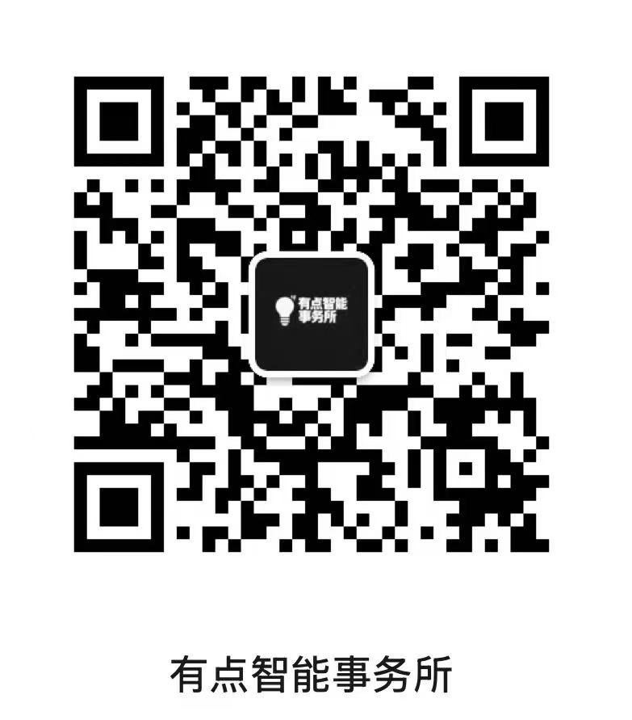

<div align="center">

# Privacy Policy Self-Service Generator MVP

MVP 隐私协议自助生成器

面向 OPC、个人开发者、独立开发者和早期创业团队的隐私协议生成 Skill。

像完成 demo 和 MVP 一样，先完成最基础、最核心、上线前不能空着的隐私协议。

<p>
  
  
  
  
  
  
  
</p>

</div>

---

当前版本：`v1.0.0`。

这是一个面向 OPC、个人开发者、独立开发者和早期创业团队的 Skill。它只生成 **MVP / 最小合规版本** 的中文隐私协议，帮助产品在上线前先把个人信息处理者、产品范围、个人信息类型、第三方或 SDK、存储与跨境、用户权利、AI 或高风险事项说清楚。

本项目源码公开，采用 [CC BY-NC 4.0](https://creativecommons.org/licenses/by-nc/4.0/) 协议，仅限个人学习、研究和非商业使用。商业使用需取得单独商业许可证。

## 为什么做这个项目

很多团队已经很会使用 AI 生成文本。

但会让 AI 写一份很长的隐私协议，并不代表真的理解自己的数据流转。

一份隐私协议可以写到几万字，但如果没有说明未成年人规则、第三方 SDK、模型训练、数据跨境、用户删除路径，那它依然可能是一份有问题的协议。

这个项目想解决的不是「把隐私协议写长」。

我更希望它帮助开发者先回答几个更具体的问题：

你的产品收集了哪些个人信息？

哪些信息是核心功能必需的？

是否使用第三方 SDK、插件、模型服务或云服务？

用户输入、上传文件、生成内容是否用于模型训练或优化？

是否涉及未成年人、敏感个人信息、跨境传输、自动化决策？

用户如何查询、删除、撤回授权、注销账号和投诉？

对很多开发者来说，隐私协议最麻烦的地方不是法律概念本身，而是它经常出现在产品快要上线的时候。Demo 已经跑通了，MVP 已经能用了，但隐私协议还没有准备好，数据流转也没有被系统梳理过。

所以这个 Skill 只做 MVP 版本。

它像帮你完成一个隐私协议的 demo：先把最基础、最核心、上线前不能空着的内容做出来，把不确定的事项列成后续完善清单，省掉从零整理协议结构和合规问题的麻烦。

隐私协议不应该只是网页底部那个没人点开的链接。它更像一张产品数据流转的体检报告。

## v1.0.0 能做什么

默认输出：

- MVP 最小合规版隐私协议正文；
- 个人信息收集简表；
- 第三方 SDK、API、插件和合作方简表；
- 用户权利路径简表；
- 本版忽略或简化内容清单；
- 后续完善事项；
- 隐私协议要求覆盖检查；
- 复查报告。

适用场景包括 AI / AIGC 工具、App、网站 / H5、小程序、SaaS、内容社区、管理端、开放平台、SDK 和个人开发者 MVP。

当前版本不生成完整深度版隐私协议，不替代正式法律意见，不保证平台审核通过，也不会在事实不清时编造 SDK、跨境、训练用途或保存期限。

## 使用方式

将 `privacy-policy-self-service-generator-mvp` 文件夹放入你的 Skills 目录后，在对话中使用：

```text
使用 privacy-policy-self-service-generator-mvp，帮我的产品生成 MVP 隐私协议。
```

Skill 会按 MVP / 最小合规版本处理，并根据产品情况收集必要事实。

## 它是如何发挥作用的

这个 Skill 的作用不是直接套一个固定模板，而是把「生成隐私协议」拆成一次产品数据流转梳理。

你可以把它理解成一个隐私协议生成前的自助问诊流程。

使用时，你需要尽量提供这些信息：产品名称、运营主体、联系方式、产品形态、适用用户、核心功能、收集的个人信息、是否使用 SDK 或第三方服务、是否涉及 AI 功能、是否有小程序 / App / 网站 / SaaS 等多个端、用户如何删除或撤回授权。

如果你还没有整理好这些信息，Skill 会根据 `templates/product-questionnaire.md` 继续追问。缺少关键事实时，它不会硬写协议，而是先列出阻断问题。

拿到产品事实后，它会做几件事：

1. 判断哪些信息属于 MVP 隐私协议必须覆盖的基础事项。
2. 检查是否涉及 AI / AIGC、小程序、App 权限、第三方 SDK、未成年人、敏感个人信息、跨境传输等高风险场景。
3. 把确认过的事实写进最小合规版隐私协议正文。
4. 用表格整理个人信息收集清单、第三方清单和用户权利路径。
5. 把暂时无法确认或暂时不展开的事项列为后续完善事项。
6. 输出复查报告，提醒哪些地方存在阻断问题、高风险问题、一致性问题或表达问题。

简单说，它先帮你把产品事实问出来，再把这些事实翻译成一份可继续迭代的 MVP 隐私协议。

对开发者来说，你不需要一开始就写出一份几万字的深度协议。你只需要先把上线前必须回答的问题说清楚，然后根据后续产品迭代继续完善。

## 版本路线图

| 版本 | 状态 | 说明 |
| --- | --- | --- |
| `v1.0.0` | 已发布 | 生成 MVP 最小合规版隐私协议，输出基础清单、后续完善事项和复查报告 |
| `v2.0.0` | 计划中 | 生成完整深度版隐私协议，支持更细颗粒度清单、跨境、委托处理、AI 训练等专项章节 |
| `v3.0.0` | 计划中 | 基于已有 MVP 协议继续扩充，在不覆盖原文的前提下补齐 SDK、AI、跨境、未成年人等模块 |

## 许可证与商业使用

本项目采用 [Creative Commons Attribution-NonCommercial 4.0 International License](https://creativecommons.org/licenses/by-nc/4.0/) 协议，简称 `CC BY-NC 4.0`。

你可以在非商业目的下复制、分享、修改和改编本项目，但必须保留作者署名、标明项目来源、保留许可证说明，并说明是否做过修改。

未经作者书面授权，不得将本项目用于商业用途。

商业用途包括但不限于：公司、团队、机构或客户项目；付费产品、付费服务、咨询服务或合规交付物；SaaS、插件、Agent、自动化工具、内部系统或商业平台集成；基于本项目向第三方提供隐私协议生成、合规审查、数据合规咨询或类似服务；商业培训、课程、转售、二次授权或商业化分发。

如需商业使用，请联系作者取得商业许可证。

## 免责声明

本项目生成或辅助生成的内容仅供参考，不构成正式法律意见、法律咨询结论、监管意见、平台审核保证或合规背书。

在正式发布、提交平台审核、对外使用或用于监管沟通前，请咨询律师、数据合规顾问或其他专业人士。

使用本项目不代表作者与你之间形成律师客户关系、法律顾问关系或其他专业服务委托关系。

## 联系我

如果你正在做 AI 产品、AIGC 工具、App、小程序、SaaS、内容社区、开发者工具，或者你的产品已经涉及用户上传内容、第三方 SDK、模型训练、未成年人、敏感个人信息、跨境访问等场景，欢迎交流。

- 个人微信：`xiarenzhimajuan`


也欢迎关注「有点智能事务所」。我会在这里持续更新新的 Skill 发布、AI 合规实践、隐私协议和数据合规相关内容。


